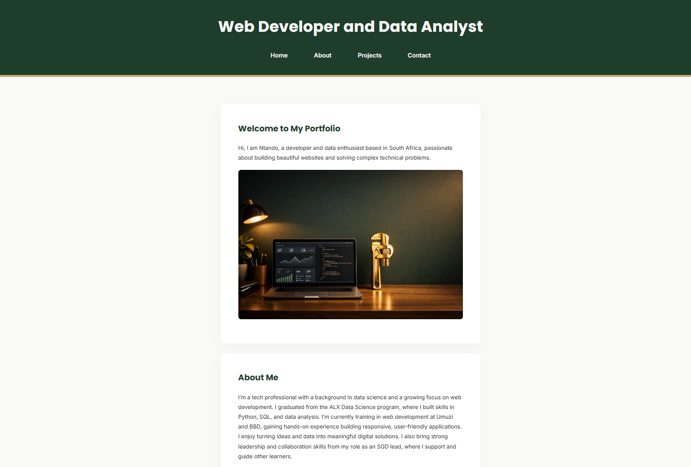
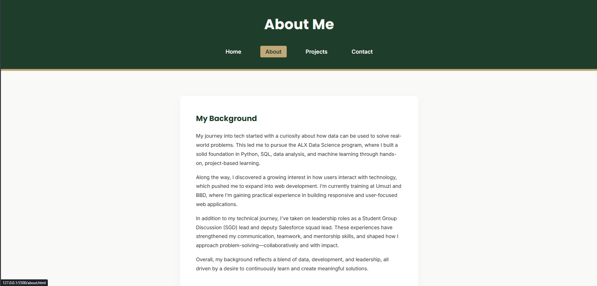
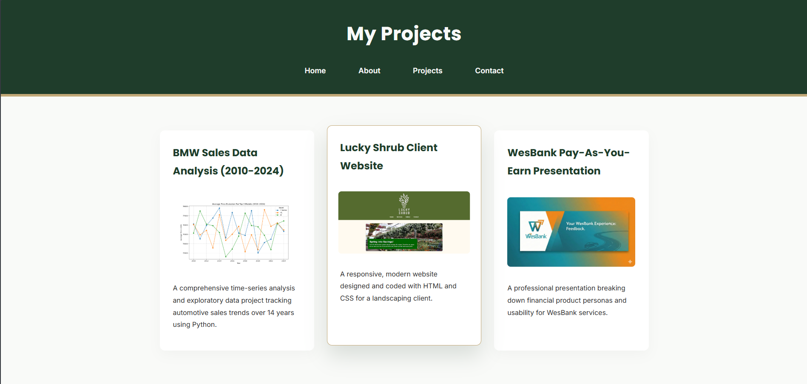
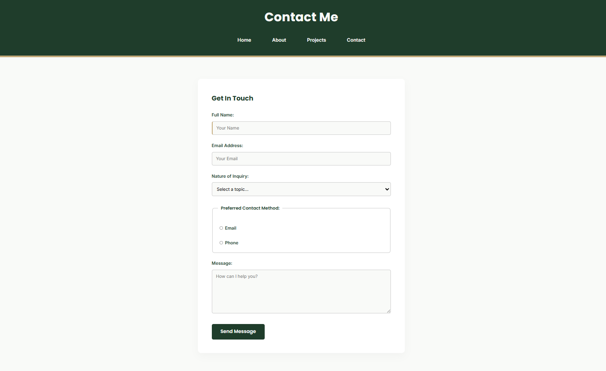
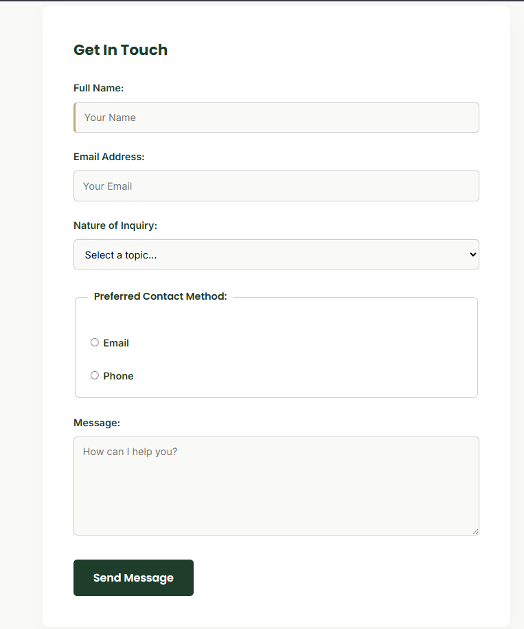
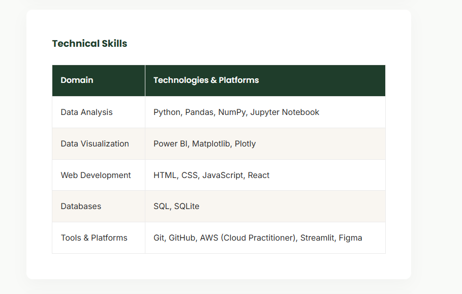
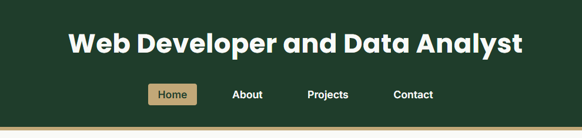
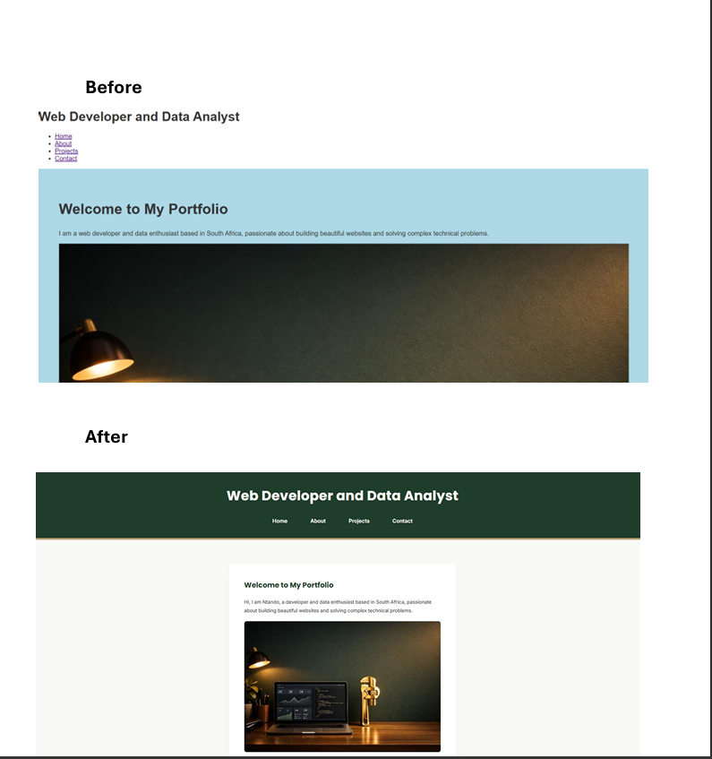

# Ntando's Portfolio: Debug Portfolio Website

## Overview

This project is a fully responsive, multi-page personal portfolio website built exclusively with HTML and CSS. The primary purpose of this website is to showcase technical skills in web development, and problem-solving. The project required taking a 70% complete, error-ridden starter template and refactoring it into a professional, semantic, and highly accessible final product.

## Issues Found

Upon initial review of the starter codebase, I identified multiple critical errors:

- **Semantic HTML:** Heavy reliance on generic `
` tags instead of semantic landmarks.
- **Missing Navigation:** The website lacked a universal navigation menu, making multi-page traversal impossible.
- **Accessibility Failures:** All images were missing `alt` text, forms lacked associated `<label>` tags, and the color palette failed WCAG 4.5:1 contrast requirements.
- **Incomplete Features:** The `about.html` page was missing a data table, and the `contact.html` form lacked input variety and validation.
- **CSS Deficiencies:** Styling relied on only basic class selectors, lacked interactive pseudo-classes, and exhibited poor box model implementation.

## Fixes Implemented

I systematically debugged the codebase by first establishing a strong HTML foundation, then layering on advanced CSS.

- **HTML Structure & Semantic Choices:** I replaced the non-semantic tags with modern HTML5 semantic elements including `<header>`, `<nav>`, `<main>`, `<section>`, and `<footer>`. I built a universal 16-link navigation menu across all four pages, constructed a fully compliant data table with `<thead>` and `<tbody>`, and rebuilt the contact form to include 5 distinct input types, HTML5 validation (`required`, `minlength`, `pattern`), and explicit label associations.
- **CSS Styling Approach & Selectors:** I overhauled the stylesheet using a custom 12-column CSS Grid layout for modern responsiveness. To meet styling requirements, I expanded selector usage to include Elements (`body`), Classes (`.project-card`), IDs (`#name`), Descendants (`header nav ul li a`), and Pseudo-classes (`:hover`, `:focus`, `:nth-child(even)`). I also implemented a premium "Deep Green" and "Soft Gold" color palette with interactive hover effects.

## Accessibility Improvements

Accessibility was a major focus of this refactor:

1. **Screen Readers:** Added descriptive `alt` text to all 5 images and established proper semantic landmarks.
2. **Forms:** Explicitly linked every `<label>` to its respective input via the `for` and `id` attributes.
3. **Visual Accessibility:** Fixed the starter code's poor contrast by implementing a dark background with off-white text. Added distinct `:focus` states to all form inputs to support keyboard-only navigation.

## Reflection: Debugging Challenges & Solutions

The biggest challenge I faced while debugging the starter code was untangling the layout issues caused by the "div soup" (excessive generic `
` tags) and the disconnected CSS. For example, when I upgraded the header from `
` to the semantic `<header>` tag, the existing styles broke.

To solve this, I realized I couldn't just patch the CSS; I needed to systematically audit the HTML structure first. I methodically replaced the HTML framework page by page, ensuring validity, and only then went back to the CSS file to update the selectors (changing `.header` to `header`, adding combinators, etc.). This top-down approach solved the cascading layout issues and taught me how deeply interconnected semantic HTML architecture and CSS selectors truly are.

## Screenshots

### 1. The Completed Pages

**Home Page:**

**About Page:**

**Projects Page:**

**Contact Page:**

### 2. Specific Component Improvements

**HTML Form (Showing Input Variety & Alignment):**

**Styled Data Table (Showing Zebra Striping):**

**Navigation Menu (Showing Hover States):**

**Footer (Like this across the website):**

### 3. Before/After Comparison

**Home Page Transformation:**

## How to View Locally

To test and view this project on your local machine, follow these steps:

1. Clone this repository to your local machine using your terminal:
   `git clone https://github.com/Umuzi-skillslab/complete-website-Ntando-Mo`
2. Navigate into the project directory:
   `cd complete-website-Ntando-Mo`
3. Open the `index.html` file in your preferred web browser (Google Chrome, Firefox, Safari, etc.) by double-clicking the file in your file explorer.
4. Alternatively, open the project folder in an IDE like VS Code and use the "Live Server" extension to view the site on a local port.
