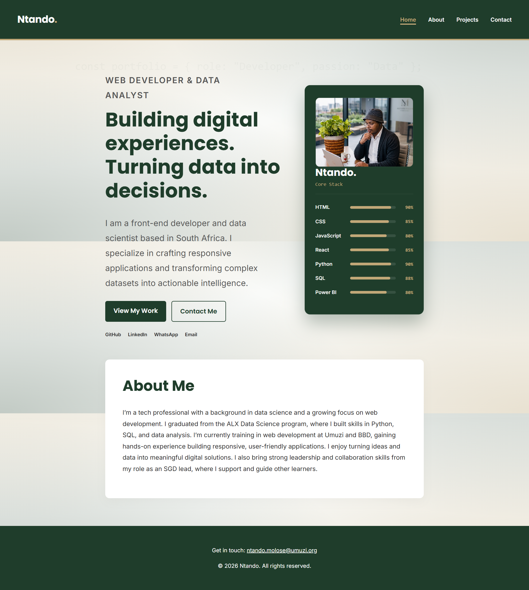
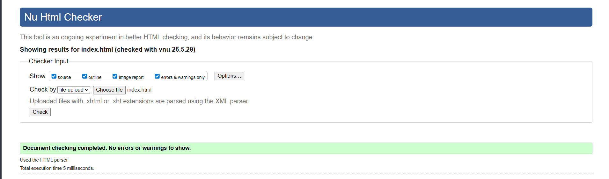
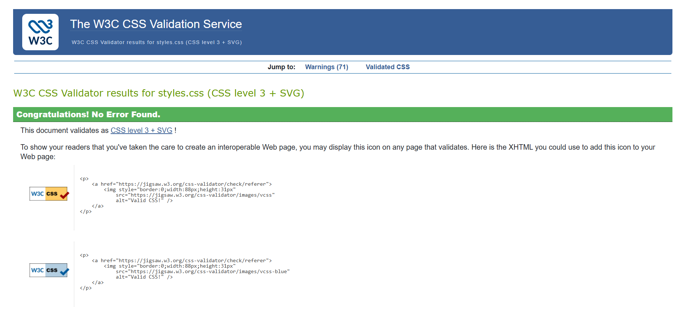
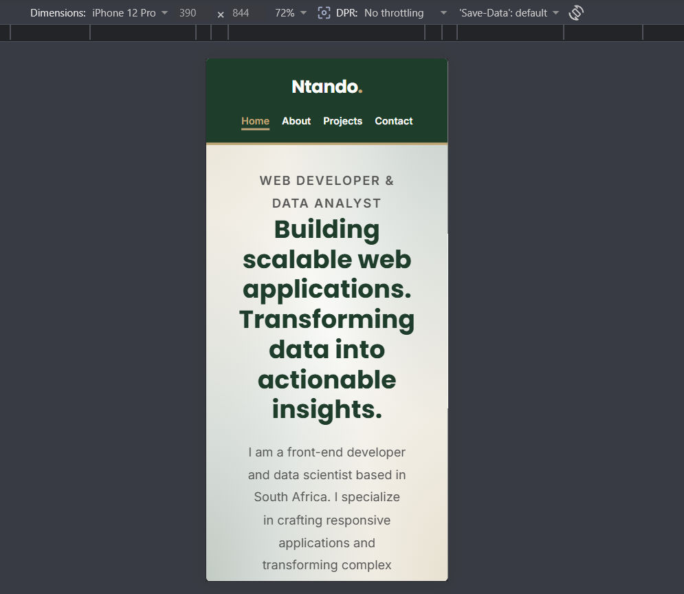
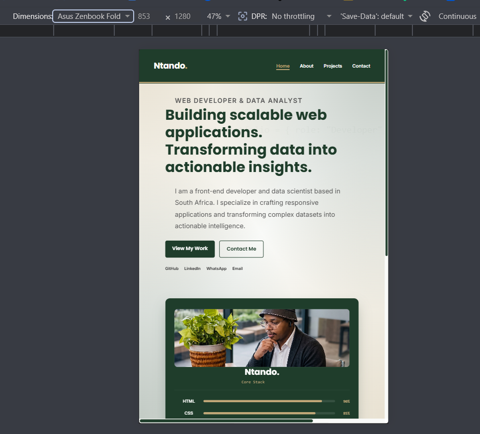
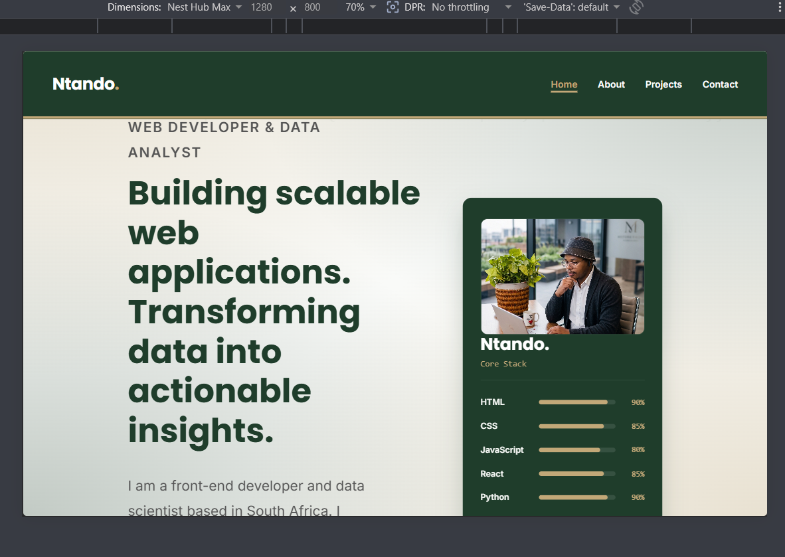

# Ntando's Portfolio: Debug Portfolio Website

## Overview

This project is a fully responsive, multi-page personal portfolio website built exclusively with HTML and CSS. The primary purpose of this website is to showcase technical skills in web development, and problem-solving. The project required taking a 70% complete, error-ridden starter template and refactoring it into a professional, semantic, and highly accessible final product.

## Detailed Issues Log 

Upon initial review of the starter codebase and subsequent W3C validation sweeps, I identified and resolved the following granular issues:

**HTML & Semantics**
1.  **"Div Soup":** Heavy reliance on generic `
` tags instead of HTML5 semantic landmarks.
2.  **Missing Navigation:** The website lacked a universal navigation menu, making multi-page traversal impossible.
3.  **Missing Table:** The `about.html` page was missing a required data table to display skills.
4.  **Legacy Syntax:** Void elements (`<meta>`, ``, `<link>`) incorrectly used legacy XHTML trailing slashes (e.g., ``), causing W3C syntax warnings.
5.  **Broken Heading Hierarchy:** Skipped heading levels (jumping from `<h1>` to `<h3>` on `index.html`), violating screen reader accessibility guidelines.
6.  **Missing H1 Landmarks:** The `about.html`, `contact.html`, and `projects.html` pages lacked an `<h1>` summarizing the page content.
7.  **Semantic Wrappers Missing:** Project cards lacked `<article>` tags, and profile images lacked `<figure>` and `<figcaption>` pairings.
8.  **Hidden Syntax Errors:** Invisible non-breaking space characters in `contact.html` caused formatting corruption.

**Accessibility**

9.  **Missing Alt Text:** All images were missing `alt` attributes.
10. **Form Label Disconnection:** Forms lacked explicitly associated `<label>` tags (missing `for` and `id` links).
11. **Poor Contrast:** The original color palette failed WCAG 4.5:1 contrast requirements.
12. **No Keyboard Support:** Lacked distinct `:focus-visible` states to support keyboard-only navigation.
13. **Missing Skip Link:** Absence of a "Skip to main content" link for screen reader users.
14. **Lack of ARIA Feedback:** Form inputs lacked `aria-describedby` hints, and navigation lacked `aria-current="page"` indicators.
15. **Unstructured Radios:** Radio buttons were not grouped logically inside a `<fieldset>` with a `<legend>`.

**CSS & Architecture**

16. **Basic Selector Dependency:** Styling relied exclusively on basic class selectors without utilizing advanced combinators or pseudo-classes.
17. **Rigid Typography:** Font sizes were static, failing to adapt fluidly to different screen sizes.
18. **Unoptimized Print Layout:** Printing the page resulted in wasted ink due to visible navigation bars and dark background gradients.

## Fixes & Advanced Enhancements Implemented

I systematically debugged the codebase by establishing a strict semantic HTML foundation, followed by deploying advanced CSS architecture.

*   **Semantic Upgrades:** Replaced `
` containers with `<header>`, `<nav>`, `<main>`, `<section>`, `<article>`, and `<footer>`. Wrapped images in `<figure>` and `<figcaption>`.
*   **Accessible Forms:** Rebuilt the contact form with 5 distinct input types, HTML5 validation (`required`, `minlength`, `pattern`, `autocomplete`), explicit label associations, and `aria-describedby` helper text.
*   **Advanced CSS Architecture:** 
    *   Implemented a responsive 12-column CSS Grid.
    *   Utilized CSS `clamp()` for fluid, perfectly scaling typography (`--step-0` through `--step-4`).
    *   Deployed advanced CSS selectors including `:is()`, `:not()`, `:focus-visible`, and adjacent sibling combinators (`h2 + p`).
    *   Engineered a fixed ambient CSS mesh gradient (`radial-gradient`) for premium visual depth.
*   **Print Optimization:** Added an `@media print` query that automatically hides navigation, removes gradients, and strips box shadows to ensure the portfolio saves as a perfectly clean PDF.

## W3C Validation & Cross-Browser Testing

**W3C Output Summary:**
*   **HTML:** 100% Pass. All four HTML files (`index.html`, `about.html`, `projects.html`, `contact.html`) passed the W3C Markup Validation Service with zero errors and zero warnings. 
*   **CSS:** 100% Pass. `styles.css` passed the W3C CSS Validator (Level 3 + SVG). *Note: The validator returns standard info messages acknowledging the presence of dynamic CSS Custom Properties (variables), which are structurally valid.*

**Cross-Browser Testing:**
The application was manually tested across multiple modern browsers to ensure feature parity:
*   **Google Chrome & Microsoft Edge (Chromium):** Flawless grid rendering, fluid typography scaling, and smooth hover micro-interactions.
*   **Mozilla Firefox:** Mesh background gradient and custom scrollbar (`::-moz-selection`) render perfectly.
*   **Mobile Emulation (Chrome DevTools):** Verified stacking order and padding adjustments on viewports matching iPhone SE (375px) through iPad Pro (1024px).
## Reflection: Debugging Challenges & Solutions

The biggest challenge I faced while debugging the starter code was untangling the layout issues caused by the "div soup" (excessive generic `
` tags) and the disconnected CSS. For example, when I upgraded the header from `
` to the semantic `<header>` tag, the existing styles broke.

To solve this, I realized I couldn't just patch the CSS; I needed to systematically audit the HTML structure first. I methodically replaced the HTML framework page by page, ensuring validity, and only then went back to the CSS file to update the selectors (changing `.header` to `header`, adding combinators, etc.). This top-down approach solved the cascading layout issues and taught me how deeply interconnected semantic HTML architecture and CSS selectors truly are.

## Screenshots

**Please note:** Some screenshots may appear like they have stirpes whereas they do not. Those stripes are only caused by the screen capturing software I used.

### 1. The Completed Pages

**Home Page:**

**About Page:**

**Projects Page:**

**Contact Page:**

### 2. Specific Component Improvements

**HTML Form (Showing Input Variety & Alignment):**

**Styled Data Table (Showing Zebra Striping):**

**Navigation Menu (Showing Hover States):**

**Footer (Like this across the website):**

### 3. Before/After Comparison

**Home Page Transformation:**

### 4. HTML W3C Validation

**Validation for all HTML pages:**

### 5. HTML W3C Validation

**Validation for CSS file:**

### 6. Responsive design testing
**iPhone 12 Pro:**

**Asus Zenbook Fold:**

**Nest Hub Max:**

## How to View Locally

To test and view this project on your local machine, follow these steps:

1. Clone this repository to your local machine using your terminal:
   `git clone https://github.com/Umuzi-skillslab/complete-website-Ntando-Mo`
2. Navigate into the project directory:
   `cd complete-website-Ntando-Mo`
3. Open the `index.html` file in your preferred web browser (Google Chrome, Firefox, Safari, etc.) by double-clicking the file in your file explorer.
4. Alternatively, open the project folder in an IDE like VS Code and use the "Live Server" extension to view the site on a local port.
